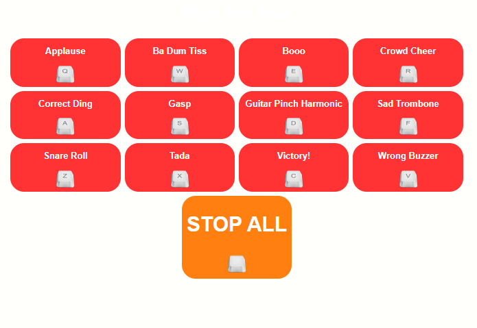

# Sound Board
### This is a simple vanilla Javascript project where user can play certain kind of small tracks like applause, boo, snare roll etc by pressing certain keyboard keys and any currently playing track can be stopped  by pressing space bar.

### here is the screen shot of the prototype:

